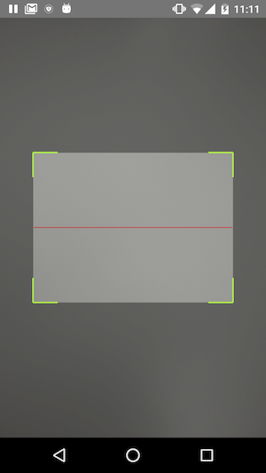

# react-native-zbar-android

[](https://npmjs.org/package/react-native-zbar-android "View this project on npm")
[](https://npmjs.org/package/react-native-zbar-android "View this project on npm")


Fast QR Code Scanner for Android based on https://github.com/ZBar/ZBar

## Demo



## Installation Android
1. `npm install react-native-zbar-android --save`
2. `react-native link react-native-zbar-android`

# Usage

```js

import { startScan } from 'react-native-zbar-android'
import React, { Component } from 'react';
import {
  AppRegistry,
  StyleSheet,
  ToastAndroid,
  View
} from 'react-native';

class MyPickers extends Component {

  render () {
    startScan(this._onBarCodeRead.bind(this))
    return (
      <View/>
    )
  }

  _onBarCodeRead (QRCodeResult) {
    if (QRCodeResult.state === 'ok') {
      let result = QRCodeResult.code
      ToastAndroid.show(result, ToastAndroid.SHORT);
    }
  }
}

```

## Questions or suggestions?

Feel free to [open an issue](https://github.com/ElekenAgency/react-native-zbar-android/issues)
